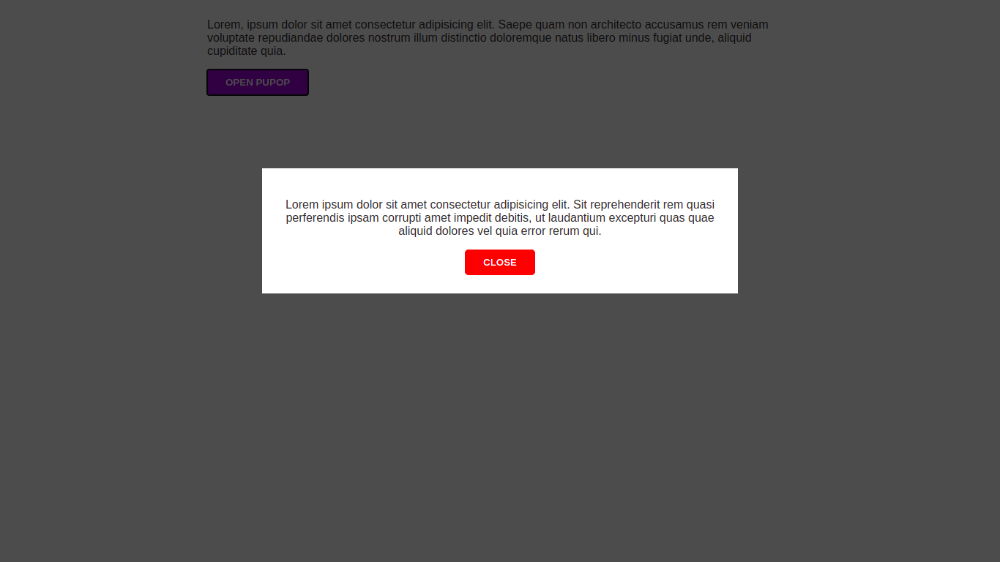

# Blog Sitesi Yönetim Paneli

> Yönetim panelinden giriş yaparak siteye yazı ekleyerek crud işlemleri yapabilir, yöneticileri ve editörleri atayabilir, kullanıcıları engelleyebilirsiniz. Temel bir blade template'de repo'da mevcuttur.



## Built With

- PHP,
- Laravel, Bulma

## Getting Started

Projeyi çalıştırmak için aşağıdaki adımları sırayla uygulayınız.

1. Aşağıdaki komutları terminalden çalıştırın.

```git clone https://github.com/emirsagit/blog.git```
```cd blog```
```composer install```
```npm install```
```php artisan key:generate```
```cp .env.exemple .env```

2. .env'yi açın. Database bilgilerinizi doğru olarak girin.

3. ```php artisan migrate --seed``` komutunu çalıştırın.

4. Tarayıcı ile /register sayfasına giderek üyeliğinizi oluşturun.

5. Phpmyadmin ya da arzu ettiğiniz database yönetim programını kullanarak users tablosunda üyelik oluşturduğunuz kişiyi bularak role_id satırına '3' yazın ve kaydedin. (Super admin yetkisi için)

6. Tarayıcı ile /admin sayfasına giderek sitenizi yönetebilirsiniz.

## Authors

👤 **Emir Sağıt**

- GitHub: [@emirsagit](https://github.com/emirsagit)
- Twitter: [@emirsagit](https://twitter.com/emirsagit)
- LinkedIn: [Emir Sağıt](https://www.linkedin.com/in/emir-sa%C4%9F%C4%B1t-633035188/)

## 🤝 Contributing

Contributions, issues, and feature requests are welcome!

Feel free to check the [issues page](../../issues/).

## Show your support

Give a ⭐️ if you like this project!

## Acknowledgments

- Thanks to [admin-one](https://github.com/user/repo/blob/branch/other_file.md) free version admin template

## 📝 License

This project is [MIT](./MIT.md) licensed.
# modal
